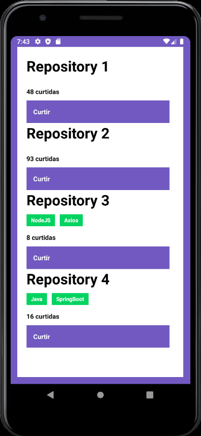

<h3 align="center">
  Challenge 04: React Native Concepts
</h3>

## :rocket: About the challenge

Integrate respository list, and likes repository with [API from challenge 02](https://github.com/franciscoescastro/portfolio-repo)

**[Full challenge description](https://github.com/Rocketseat/bootcamp-gostack-desafios/tree/master/desafio-conceitos-react-native)**

<p align="center">
  
</p>

### Application functionalities 

- **`List all repositories`**: get all repositories from API and add list to the component
- **`Like a repository`**: update the number of likes

### Setup

```shell
# Clone this repository
$ git clone git@github.com:franciscoescastro/portfolio-repo-react-native-gostack.git

# Go into the repository
$ cd portfolio-repo-react-native-gostack

# Install dependencies
$ yarn

# Run tests
$ yarn test

```

## License

[](http://badges.mit-license.org)

- **[MIT license](http://opensource.org/licenses/mit-license.php)**
